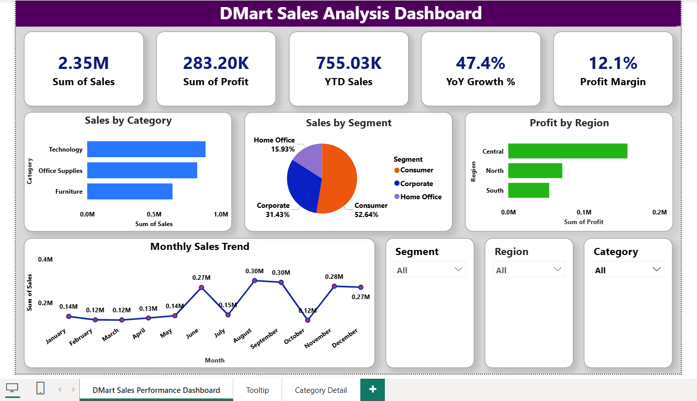
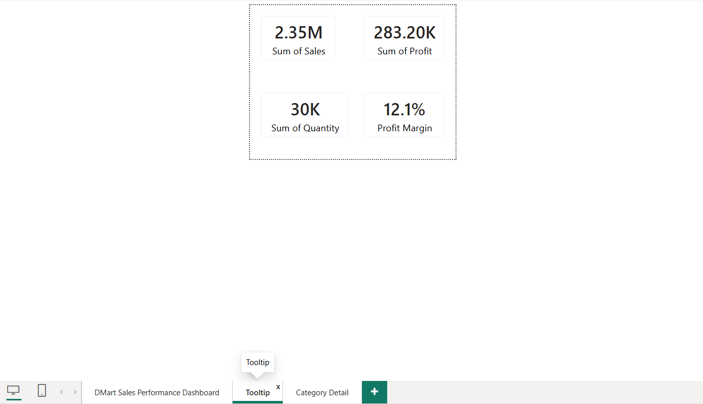
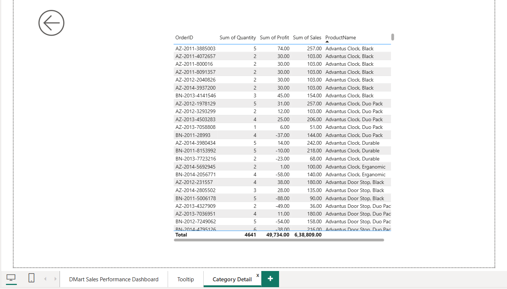

# 🛒 DMart Sales Data Analysis

## 📌 Project Overview

This project is an end-to-end Data Analytics solution developed to analyze DMart sales data and generate meaningful business insights using Excel, Python, SQL Server, and Power BI.

The workflow includes data cleaning, transformation, storage, analysis, and interactive dashboard creation to support data-driven decision-making.

---
## 🎯 Business Objective

The objective of this project is to analyze DMart sales data and uncover meaningful business insights related to sales performance, profitability, customer segments, product categories, and regional trends.

By leveraging data analytics and interactive visualizations, the project helps stakeholders monitor key performance indicators (KPIs), identify growth opportunities, and support data-driven business decisions.

---

## 🛠️ Tech Stack

- Microsoft Excel
- Python
- SQL Server
- Power BI

---

## 🔄 Project Workflow

Excel Source Data
→ Python (Data Cleaning & ETL)
→ SQL Server (Data Storage & Analysis)
→ Power BI (Interactive Dashboard & Business Insights)

---

## 📊 Dashboard Preview

### Main Dashboard

### Custom Tooltip

### Drillthrough Analysis

---

## ✨ Project Features

- End-to-end Data Analytics workflow
- Data cleaning and preprocessing using Python
- Data storage and querying using SQL Server
- Interactive Power BI dashboard
- Custom Tooltip implementation
- Drill-through analysis
- KPI tracking and business performance monitoring
- Interactive slicers and filters
- Visual representation of sales trends and profitability
